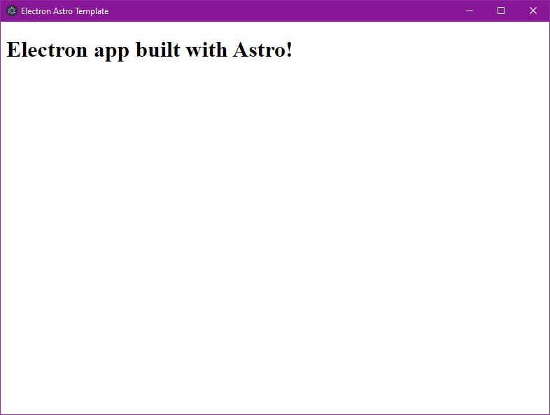

fork from [charlesshook/electron-astro-barebone-template](https://github.com/charlesshook/electron-astro-barebone-template)

# Electron Astro Template

A Electron app using the Astro framework.

## Features
- Barebones Astro implementation
- Barebones Electron implementation
- using component

## Commands

| Command                | Action                                             |
| :--------------------- | :------------------------------------------------- |
| `yarn`                 | Install dependencies                               |
| `yarn electron:serve`  | Run electron app for development                   |
